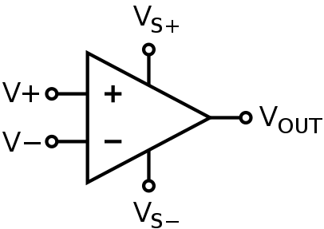
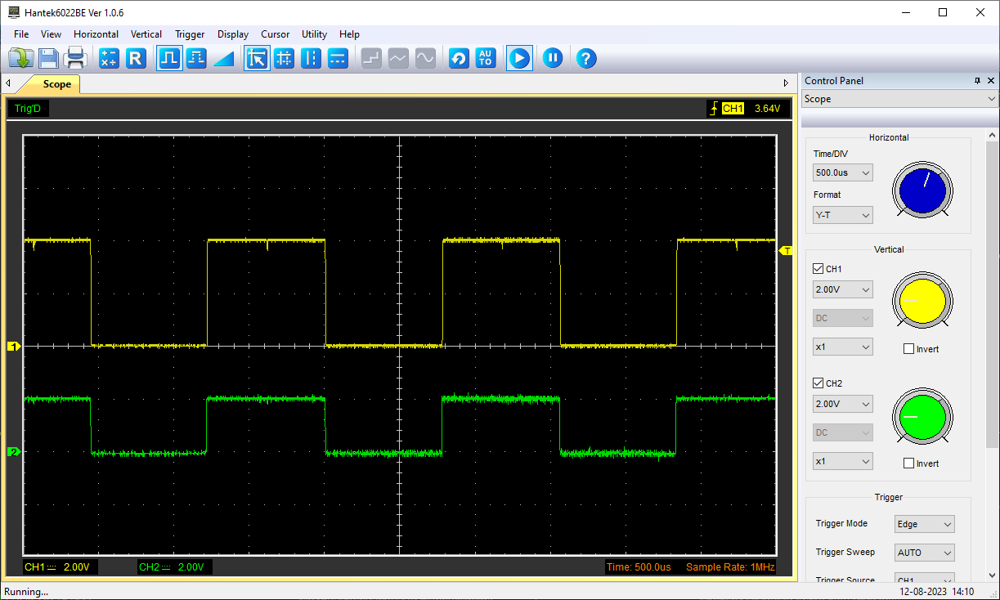

# OPAMP Libray for Uno R4 Minima & WiFi

## Description

The Arduino Uno R4 Minima and WiFi boards, both a featuring a Renesas R7FA4M1AB3CFM#AA0 microcontroller, do have a built-in OPAMP peripheral.

OMAMPs are very versatile. They can:
* mirror an input voltage to its output ("voltage follower") 
* amplify a small analog voltage to its output pin, output voltage range from 0 to ~4.7V ("non-inverting amplifier")
* compare two input voltages and give a binary "higher" or "lower" output ("comparator")
* integrate and differentiate signals ("integrator", "differentiator")
* many more

Electrical characteristics:
* Input from 0.2V (low speed) / 0.3V (highspeed) to AVCC0 - 0.5V (lowspeed) to AVCC0 - 0.6V (high-speed) 
* Output from 0.1V to AVCC0 - 0.1V
* Open gain: 120dB typical
* Input offset voltage: -10 to 10mV
* Gain-bandwidth product: 0.04MHz (low-speed) / 1.7 MHz (high-speed)
* Load current: -100 to 100µA max.

## Usage

To startup the opamp, simply include the library and call `OPAMP.begin()`. You can optionally chose to use a low-speed (=lower power) or high-speed (default) mode.

```cpp
#include <OPAMP.h>

void setup () {
    OPAMP.begin(OPAMP_SPEED_HIGHSPEED);
}

void loop() {}
```

## Pinout

Both the Uno R4 Minima and WiFi feature their OPAMP channel 0 output on the same pins:
* Analog A1: Plus
* Analog A2: Minus
* Analog A3: Output



(Vs+ is fixed to about 5V, Vs- is fixed to GND.)
## Testing

To test the OPAMP in the simplest possible "voltage follower" configuration, connect A2 to A3.
Then, any voltage applied at A1 should be mirrored onto A3. For example, if you connect A1 to GND, the OPAMP output should be GND.
Connect A1 to 3.3V, the output should be 3.3V.

For an amplifier circuit, see https://www.electronics-tutorials.ws/opamp/opamp_3.html. A simple 2x amplifier can be built by using e.g. two 10K resistors: Connect one resistor between "Minus" and GND. Then use the second resistor to connect the output and "Minus" together. Any signal input at the "Plus" will now appear with double the amplitude at the output pin. Of course, the input signal and the Arduino Uno R4 should share the same GND and the amplified output signal should not go above ~4.7V, otherwise clipping will appear.

Below is a capture of an oscilloscope in which a circa 2V square-wave (green, channel 2) is amplified to 4V square-wave (yellow, channel 1) with the aforementioned circuit.

